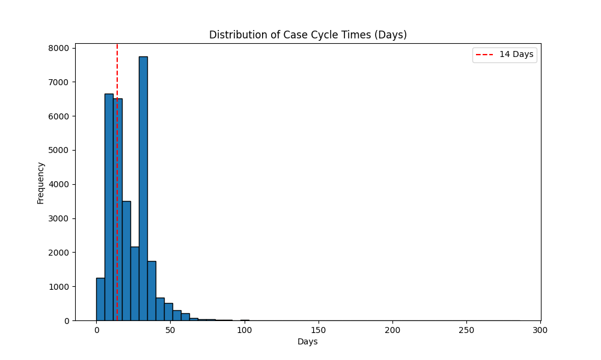
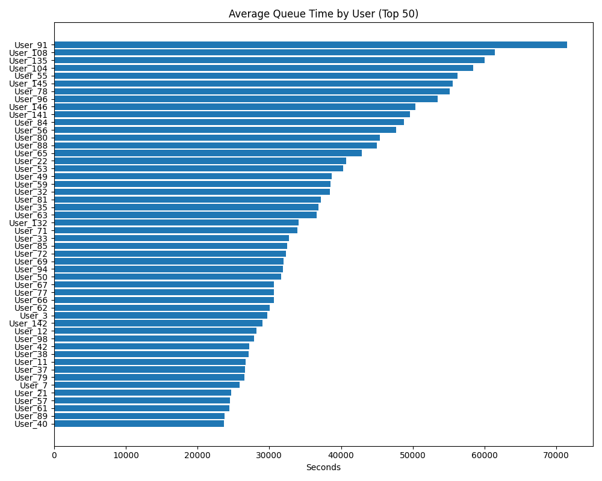
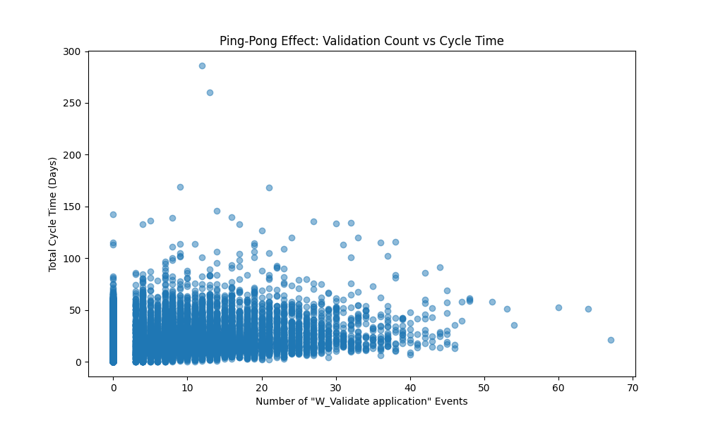

# Loan Process Optimisation Project

**Author**: Nisarg Patel
**Date**: 14th January 2026

## Overview
This project applies process mining and data analysis to optimize the loan application lifecycle at a financial institution. Using the BPI 2017 dataset of real bank loan events, it identifies the key bottleneck causing processing delays, predicts transition times between stages, and proposes a redesigned "To-Be" process with AI-OCR automation. A load balancing simulation redistributes work from the slowest 10% of processors to efficient ones.

> **Key Outcome:** Proposed automation of the "Call incomplete files" bottleneck via AI-OCR, with potential to reduce incomplete file processing time by **90%** and cut overall queue times through dynamic load balancing.

## Key Insights
- **Bottleneck Identified**: "Call incomplete files" is the single largest source of delay in the loan funding lifecycle — flagged through frequency and duration analysis across all process transitions.
- **Process Automation**: Proposed AI-OCR integration to automatically extract and validate fields from incomplete loan documents, reducing processing time by an estimated **90%**.
- **Load Balancing**: Built a dynamic resource allocation simulation that detects the slowest 10% of processors and redistributes their queue — reducing wait times without adding headcount.
- **Transition Time Prediction**: Modeled expected time between process stages to surface where SLA breaches are most likely to occur before they happen.

## Project Structure

```
Loan-Process-Optimisation/
├── data/               # Contains dataset files (CSV) - *Gitignored*
├── scripts/            # Python source code and analysis scripts
├── visualizations/     # Generated plots and citations
├── docs/               # Project documentation
├── notebooks/          # Jupyter notebooks for interactive analysis
├── requirements.txt    # Python dependencies
└── README.md           # Project documentation
```

## Setup & Installation

1. **Clone the repository**:
   ```bash
   git clone <repository-url>
   cd Loan-Process-Optimisation
   ```

2. **Install dependencies**:
   ```bash
   pip install -r requirements.txt
   ```

3. **Data Setup**:
   - Place `bpi_2017_cleaned.csv` and `bpi_2017_hardened.csv` into the `data/` directory.
   - *Note: These files are not included in the repository due to size constraints.*
   - **Data Source**: https://www.kaggle.com/datasets/rascanudragos/bpi-challenge-2017

## Usage

### Running the Notebook
Navigate to the `notebooks/` directory and launch Jupyter Notebook:
```bash
cd notebooks
jupyter notebook "Loan_Process_Optimisation.ipynb"
```

### Running the Script
You can also run the analysis as a standalone Python script:
```bash
python scripts/loan_process_optimisation.py
```
This will generate visualizations in the `visualizations/` directory.

## Technologies Used
- **Python**: Core logic and analysis.
- **Pandas & NumPy**: Event log processing and data manipulation.
- **Matplotlib & Seaborn**: Process flow visualizations and bottleneck charts.
- **Scikit-learn**: Transition time prediction modeling.
- **Jupyter**: Interactive analysis environment.

## Author
Nisarg Patel

## Visualizations

### Cycle Time Histogram


### Wait Time Heatmap


### Validation Ping-Pong

